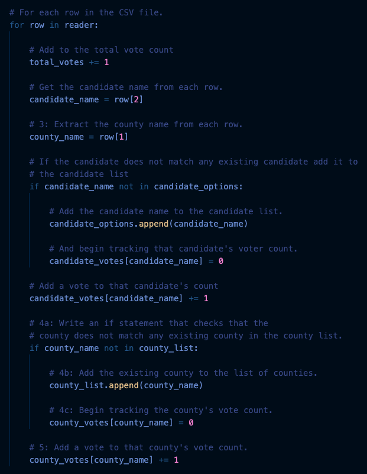
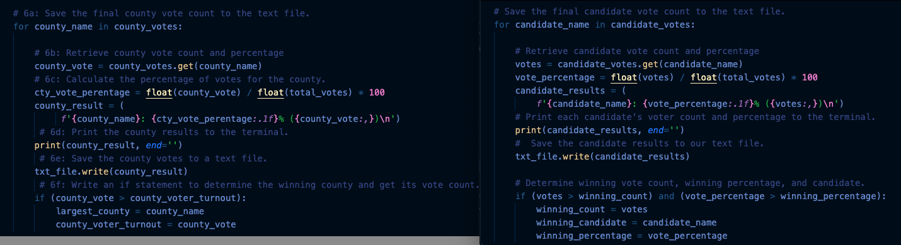
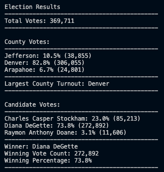
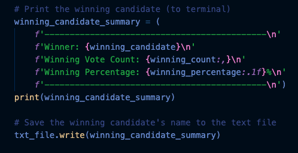
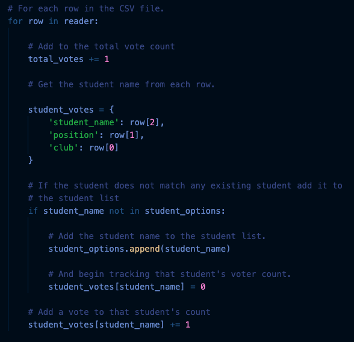

# ELECTION ANALYSIS

## Election Overview
A Colorado Board of Elections employee, Tom, has given me the following tasks to complete the election audit of a recent local congressional election.
1. Calculate the total number of votes cast in the Congressional Election.
2. Get a complete list of the counties that participated in this election.
3. Calculate the breakdown of the number of votes and the percentage of total votes for each county present.
4. Determine the county that had the largest number of votes.
5. Get a complete list of candidates who received votes in this election.
6. Calculate the breakdown of the number of votes and the percentage of total votes for each candidate.
7. Determine which candidate won the election, what was their vote count, and what was the percentage of the total votes/

## Resources
* Data Source: election_results.csv
* Software: Python 3.7.6, Visual Studio Code 1.60.1

## Election Audit Results
The analysis of the election will show that:
1. There were 369,711 number of votes cast in the election.
2. There were 3 Counties included in this vote
> * Arapahoe
> * Denver
> * Jefferson
3. The County vote results were:
> * Arapahoe County received 6.7% of the vote and 24,801 number of votes.
> * Denver County received 82.8% of the vote and 306,055 number of votes.
> * Jefferson County received 10.5% of the vote and 38,855 number of votes.
4. The county with the largest voter turnout is Denver County.
5. The candidates were:
> * Charles Casper Stockham
> * Diana DeGette
> * Raymon Anthony Doane
6. The Candidate results were:
> * Charles Casper Stockham received 23.0% of the vote and 85,213 number of votes.
> * Diana DeGette received 73.8% of the vote and 272,892 number of votes.
> * Raymon Anthony Doane received 3.1% of the vote and 11,606 number of votes.
7. The winner of the election was:
> * Diane DeGette, who received 73.8% of the vote and 272,892 number of votes.
---
## Election-Audit Summary
This election audit program, is a simple way to take the data of any election, provided in an csv formatted file, and can automatically count and determine the total votes in an election. The first analysis is the county and it determines the number of counties, largest percentage and number of votes. The next step will then determine each candidates votes, their percentage of the total vote, then who is the actual candidate winner. The code snippet below is how I read in the csv values, assigned them to variables and began counting the votes for the Candidate and County.
---
_Code_ _Snippet_

The presentation to the screen and results file will show you in detail, the total votes, county votes and percentages, candidate votes and percentages, and the county with the largest vote turnout, as well as the winning candidate.  This will also prove in one single snapshot that the audit, proves that there are no missing votes as all votes are accounted for.  The calculation of the County Winner and Candidate Winner, as you can see are very similar, below is the code snippet of each.
---
_Code_ _Snippet_

---
Here is the results of our audit of a Local Congressional Election in Colorado recently:
1. The first image is the output received to the screen.   
2. The second image is the output to a text file, that can be emailed to your staff for distribution and saved for your records. (You will need to click on the words File Output to view the file)
3. The third image is the way I sent the results to the screen are as follows, see code snippet below: 
 

 
[_File_ _Output_](analysis/election_analysis.txt)
---
_Code_ _Snippet_

 
## Updates and modification options
_Note:_  This program was run on an election with just under 400,000 votes and completed under 1 minute. I am confident that this will run on larger voting files, with a larger number of counties represented and candidates represented, without any code changes.  The speed may be a bit longer, depending on the system this is run on.

* This program, as written, can be used for any election in which the we are looking at data in the format of ['Ballot ID','County','Candidate'] provided in a csv file.  Very minimal changes would need to be made, and those are to the location of the provided csv file and the name of the csv file. 

> _Code_ _Snippet_

* __Idea-1__, would be a simple update, in which we could count and analyize a different type of election, in which the column names are changed.  With the use of our variables, the modification again would be simple. So if the csv file came in with ['Club','Position','Student'], we could again make some simple variable name change and position change and we can then calulate all of the clubs that were voted on, and what student received the most votes for each position available for that club.

> _Code_ _Snippet_

* __Idea-2__, We can also make a simple update to have another field added to the csv file.  Say you wanted to audit all of the states congressional elections.  We could add additional section of code to calculate the votes per state.  So the provided csv file would come in something like ['Ballot ID','State','County','Candidate'] and you can continue on your way to endless possibilities.   

* __Idea-3__ to improve the code, once we started having large amounts of input to calculate, would be to create subprograms to 'calculate the votes' and 'print the output'.  This way you can shorten your for loops to send in your 'item to calculate' into your calculate subroutine, and when done you can then send the finished counts to your print subroutine which can send to the screen and and file as desired.  You will end up with much cleaner code and only 2 places to change if a new customer comes along and wants a different printing format or if you need to change how you calculate your input data.

